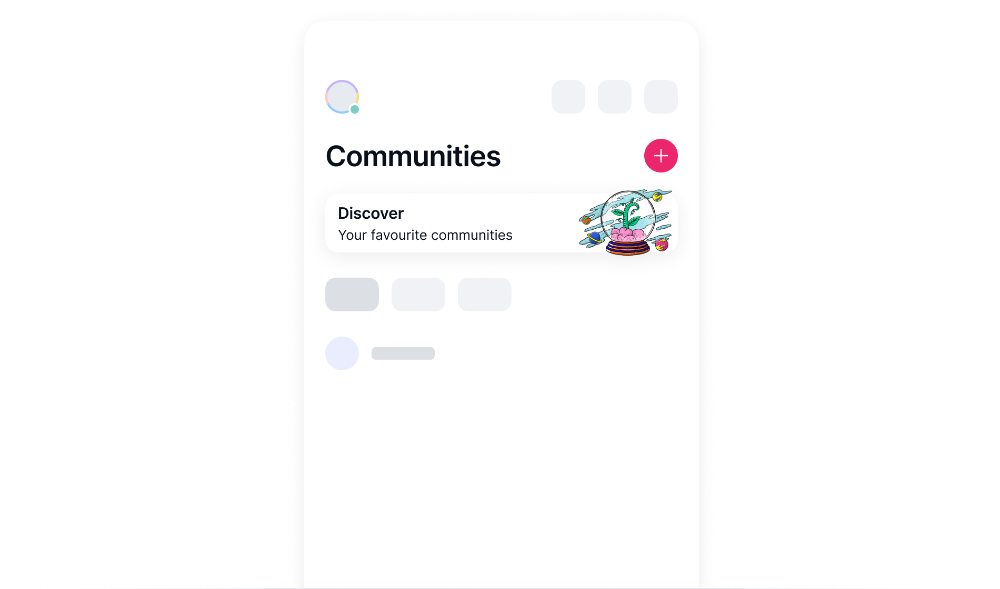

# About voting to change the community visibility

All SNT holders can vote whether to [include, exclude][vote-to-make-a-community-private-or-public], or [feature a Status Community][vote-to-feature-a-community] on the Communities Discover page within the Status app. Only voters decide the outcome of the vote, and Status has no control over the voting results.

Votes happen on the [community directory curation dApp][curate.status.app]. This is an independent, decentralized application deployed on the [Optimism network][layer-2-scaling-solutions-for-ethereum] and is separate from the Status app.

## The basics

- Every SNT holder, not just community members or Status users, can participate in all voting steps.
- Your voting power is determined by how many SNT tokens you stake.
- You don't spend or lose control over the SNT tokens when you vote, but you must hold them during the [validation][about-verification] and [finalization][about-finalization] periods for your vote to count.
- You pay a [gas fee][understand-network-fees] in ETH for initiating, validating and finalizing a vote. The amount of gas fee depends on the traffic of the Optimism network.

!!! note
    Status does not charge you any fees for voting.

## Voting to make a community public or private

When a community is created, it's a [private community][about-the-different-types-of-status-communities] by default, SNT holders can [vote to make it public][vote-to-make-a-community-private-or-public].
<!--
(Not implemented yet)
When initiating a vote, your minimum stake is ~200k SNT. However, for every unsuccessful voting attempt, the minimum SNT required to start a new vote doubles.

If a single vote exceeding 2,000,000 SNT supports the community's removal, the remaining voting period reduces to 24 hours. However, this can be reversed if a single vote of over 2,000,000 SNT opposes the removal.
-->
During the 14-day voting period, people can vote for or against adding or removing the community in question. Next, there is a seven-day [verification period][about-verification]. If no one verifies the vote within this period, only the initial vote is counted.

After the verification period, the vote must be [finalized][about-finalization] to reach a result. If a vote doesn't pass, the same vote can be initiated again after 30 days.

## Voting to feature a community

SNT holders can [promote their favourite communities by voting][vote-to-feature-a-community]. After each round of vote, up to five communities with the highest number of SNT tokens get a spot in the Featured section in Communities, replacing the communities that were featured previously.

During the five-day voting period, people can vote for any communities listed in Directory of the dApp. Next, there is a two-day [verification period][about-verification]. If no one verifies the vote within this period, only the first vote of this round is counted.

After the verification period, the vote must be [finalized][about-finalization] to reach a result.

Once a community leaves the Featured section, you can't vote for it for the next three rounds of vote. The Feature this community button next to the name of this community is greyed out and disabled.

## Voting process

Whether you're voting to add, remove or feature a community, the process involves five steps shown in the table.

Voting is a collaborative process. While you are not required to complete all steps, your involvement boosts the vote's integrity.

| Voting step | Who can participate | Gas fee required |
|:---|:---|:---|
| 1. Connect your wallet | Any SNT holder | No |
| 2. Initiate a voting process | Any SNT holder, at least one person | Yes |
| 3. Cast your vote | Any SNT holder | No |
| 4. [Verify the vote][about-verification] | Any SNT holder, at least one person | Yes |
| 5. [Finalize the vote][about-finalization] | Any SNT holder, at least one person | Yes |

### About verifying a vote {: #about-verification}

When you verify a vote, everyone's votes are sent to the smart contract of the dApp, which selects valid votes. A vote is valid only if it includes the voter's signature and the voter has enough SNT to back the vote at the time of verification.

For all valid votes to be counted, it's better if more people verify the vote.

### About finalizing a vote {: #about-finalization}

After the verification period ends, at least one person should finalize the vote. Otherwise, the vote remains pending.

When you finalize an ongoing vote, the smart contract rechecks all valid votes against the SNT balances of voters. Votes from those without sufficient balance are not counted.

Once a vote is finalized, the community is added, removed or featured on the Discover page within the Status app based on the voting result.

--8<-- "includes/urls-en.txt"
